  

  

  
  

  

### 🧬 About Me (Core Identity)

I am a **Software Engineer** specializing in transaction-safe backend services, scalable object-oriented systems, and machine learning models. I focus on developing clean, well-architected software and analyzing the intersections of Graph Deep Learning and Quantum computing.

  

  

  

### 🛠️ Tech Stack & Skills

  

  

  

### 🏦 Centerpiece Systems

#### 🏛️ [Bank Management System](https://github.com/Raju3114) &amp; 🧠 [Hybrid Quantum Graph Neural Network](https://github.com/Raju3114)

  

  

  

  

  

### 📊 Performance Analytics

  
  

---

### 👾 Commit Invaders (Diagnostics Grid)

The grid below tracks contributions to my repositories, defended daily from waves of commit invaders.

  <picture>
    <source media="(prefers-color-scheme: dark)" srcset="https://raw.githubusercontent.com/Raju3114/Raju3114/main/commit-invaders-dark.svg">
    <source media="(prefers-color-scheme: light)" srcset="https://raw.githubusercontent.com/Raju3114/Raju3114/main/commit-invaders.svg">
    
  </picture>

  

  

  

