<p align="center">
  
</p>

<p align="center">
  
</p>

<p align="center">
  <a href="https://raju3114.github.io/" target="_blank"><strong>🌐 Connect to Live Interface</strong></a> | 
  <a href="mailto:raj3114kumar@gmail.com"><strong>📩 Transmit Comms Signal</strong></a>
</p>

```text
══════════════════════════════════════════════════════════════════════════════
                 MISSION CONTROL // RAJU-OS v2.0 // ONLINE
══════════════════════════════════════════════════════════════════════════════
```

### 🧬 About Me (Core Identity)

I am a **Software Engineer** specializing in transaction-safe backend services, scalable object-oriented systems, and machine learning models. I focus on developing clean, well-architected software and analyzing the intersections of Graph Deep Learning and Quantum computing.

- ⚙️ **Core Focus:** Java Scalability, Relational Databases, and Quantum ML.
- 🚀 **Philosophy:** Writing clean, thread-safe, and self-documenting code.
- 🧠 **Learning:** Distributed computing systems and reactive programming.

<br>

<p align="center">
  
</p>

```text
══════════════════════════════════════════════════════════════════════════════
                   SHIP SYSTEMS // MONITOR & DIAGNOSTICS
══════════════════════════════════════════════════════════════════════════════
```

### 🛠️ Tech Stack & Skills

* ☕ **Backend Engine:** Java 17, JDBC Interfaces, Python
* 🗄 **Database Systems:** MySQL, Relational DBMS design, query structures
* ⚡ **Systems Core:** Data Structures & Algorithms (DSA), Object-Oriented Design (OOD)
* ⚛️ **Frontend Layers:** React, TypeScript, HTML5, CSS3, ES6
* ⚙️ **Tools & Build:** Git / GitHub, Maven build systems, PyTorch

<br>

<p align="center">
  
</p>

```text
══════════════════════════════════════════════════════════════════════════════
                   MISSION PORTFOLIO // ACTIVE PROTOCOLS
══════════════════════════════════════════════════════════════════════════════
```

### 🏦 Centerpiece Systems

#### 🏛️ [Bank Management System](https://github.com/Raju3114)
> **Stack:** Java 17, JDBC, MySQL, React, TypeScript
>
> A transaction-safe financial ledger system designed with a strict Layered Architecture to manage accounts, process fund transfers, and protect data integrity.
> - **Transaction-Safe:** Full support for SQL rollbacks on nested transaction failures to prevent balance discrepancy.
> - **Thread-Safe:** Thread-locking paradigms to ensure concurrent deposit/withdraw requests execute sequentially.
> - **Modular API:** Exposes clean REST API routes consumed by a React-TypeScript dashboard.

#### 🧠 [Hybrid Quantum Graph Neural Network](https://github.com/Raju3114)
> **Stack:** Python, PyTorch, Scikit-learn, PCA, GNNs
>
> An experimental AI network leveraging Graph Neural Networks integrated with quantum-inspired classification mechanisms to achieve highly accurate graph predictions.
> - **High Accuracy:** Attains a **98% predictive classification rate** on structured graphs.
> - **Data Compression:** Uses Principal Component Analysis (PCA) to compress high-dimensional node features prior to neural training.
> - **Deep Learning:** Leverages PyTorch-Geometric structures to run deep graph convolution steps.

<br>

<p align="center">
  
</p>

```text
══════════════════════════════════════════════════════════════════════════════
                   ARCADE MODE // HOSTILE ENGAGEMENT
══════════════════════════════════════════════════════════════════════════════
```

<p align="center">
  
</p>

```text
══════════════════════════════════════════════════════════════════════════════
                   GITHUB DIAGNOSTICS & SYSTEM METRICS
══════════════════════════════════════════════════════════════════════════════
```

### 📊 Performance Analytics

<p align="center">
  
  
</p>

---

### 👾 Commit Invaders (Diagnostics Grid)

The grid below tracks contributions to my repositories, defended daily from waves of commit invaders.

<p align="center">
  <picture>
    <source media="(prefers-color-scheme: dark)" srcset="https://raw.githubusercontent.com/Raju3114/Raju3114/main/commit-invaders-dark.svg">
    <source media="(prefers-color-scheme: light)" srcset="https://raw.githubusercontent.com/Raju3114/Raju3114/main/commit-invaders.svg">
    
  </picture>
</p>

```text
══════════════════════════════════════════════════════════════════════════════
                    [SECURE CONNECTION TERMINATED // OFF]
══════════════════════════════════════════════════════════════════════════════
```
